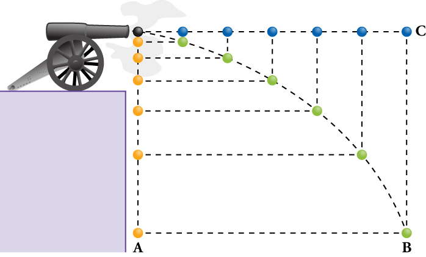
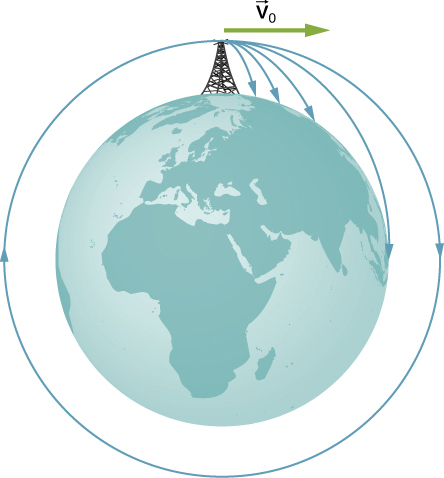

# 🚀 Projectile Motion

## Introduction

Projectile motion is the motion of an object thrown (projected) into the air when, after the initial force that launches the object, air resistance is negligible, and the only other force that the object experiences is the force of gravity. The object is called a projectile, and its path is called its trajectory.

The most important concept in projectile motion is that horizontal and vertical motions are independent when air resistance is ignored, meaning they don’t influence one another.

Since vertical and horizontal motions are independent, we can analyze them separately, along perpendicular axes. To do this, we separate projectile motion into the two components of its motion, one along the horizontal axis and the other along the vertical.

<figure><figcaption></figcaption></figure>

## Learn by Coding

### Python Juputer Notebooks

Follow the [link ](https://colab.research.google.com/drive/1I21903jU5xJh1mQWj\_eo2MBCkckwhP5d?usp=sharing)to open the juputer Notebook and follow the instructions

### Build a simulation with Turtle - Python

Simulate the projectile motion with Turtle Python following the instructions provided.



## Applications

Projectile to satellite. In each case shown here, a projectile is launched from a very high tower to avoid air resistance. With increasing initial speed, the range increases and becomes longer than it would be on level ground because Earth curves away beneath its path. With a speed of 8000 m/s, orbit is achieved.

<figure><figcaption></figcaption></figure>
